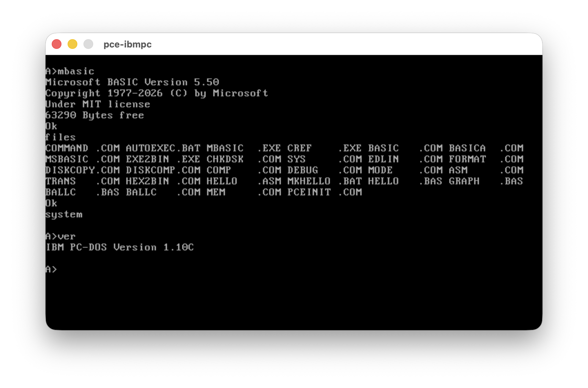
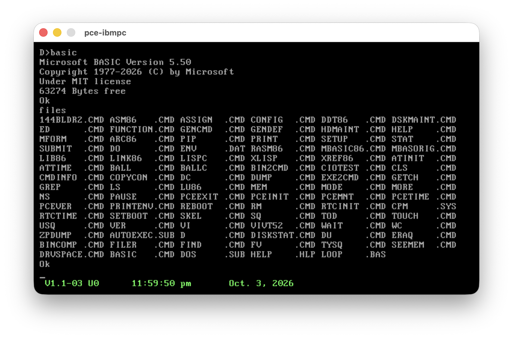
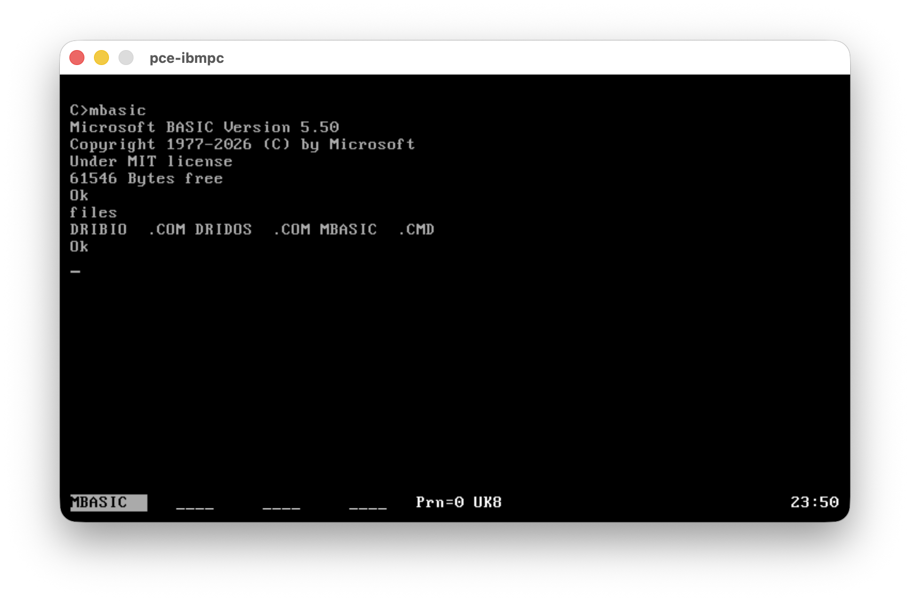
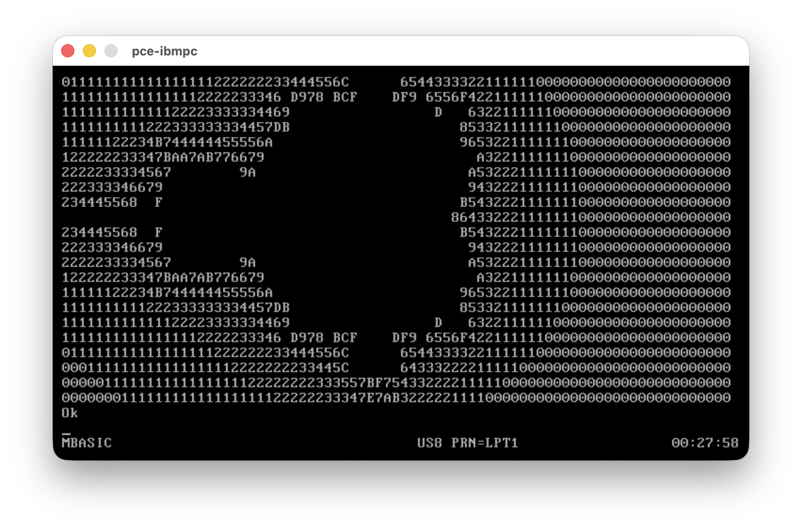

# MBASIC 5.50 — BASIC-86 for MS-DOS and CP/M-86

A text-mode Microsoft BASIC interpreter rebuilt from the 1983 GW-BASIC sources:
graphics and PC hardware removed, tokens and behaviour aligned on MBASIC 5.28,
one source tree producing an MS-DOS `.COM` and a CP/M-86 `.CMD`.

## 1. Why and what

| | |
|---|---|
| Why | Fun, nostalgia and history: get a working, buildable Microsoft BASIC-86 back from published source |
| Source | [microsoft/GW-BASIC](https://github.com/microsoft/GW-BASIC) (1983, MIT) |
| Result | MBASIC 5.50: everything MBASIC 5.28 does, nothing PC specific, Works on both DOS and CP/M |
| Rule | May do more than 5.28 / 5.22, never less |
| Manual | [docs/basic-5.0.pdf](docs/basic-5.0.pdf): BASIC-80 5.0 reference manual, also valid for this version (5.50 follows the 5.x language) |

### The family, as far as the sources tell

| Product | Year | CPU / OS | Relation |
|---|---|---|---|
| Altair BASIC | 1975 | 8080 | Origin of `BINTRP` ("Bill Gates and Paul Allen", Monte Davidoff math) |
| BASIC Rev. 4.51 [CP/M Version] | 1977 | 8080 / CP/M-80 | Earlier CP/M release (banner: "Copyright 1977 (C) by Microsoft"), before the 5.x line and MBASIC.COM naming; not part of these sources, binary kept in `ref/` |
| BASIC-80 (MBASIC) 5.21 | ~1981 | 8080 / CP/M-80 | Disk BASIC 5.x, the language MBASIC users know |
| BASIC-86 5.22 | 1982 | 8086 / CP/M-86 | 5.x mechanically translated from 8080 to 8086 (headers: "translation created … by Version 4.3") |
| MBASIC 5.28 | 1983 | 8086 / MS-DOS | Same 5.x line on MS-DOS; adds BLOAD/BSAVE, CALLS, DATE$, TIME$ |
| GW-BASIC | 1983 | 8086 / MS-DOS | Same translated core + generalized I/O (GIO), screen editor, graphics, sound, events |
| **MBASIC 5.50** (this) | 2026 | 8086 / MS-DOS, CP/M-86 | GW-BASIC core minus PC specifics, 5.28 tokens and behaviour, teletype console |

## 2. Runs on

Quick start-up checks (banner, `FILES`, program entry) on PCE/ibmpc; not an extensive test.

 PC-DOS 1.10 (.EXE) &nbsp;·&nbsp; CP/M-86 1.1 (.CMD) 

 Concurrent DOS 4.1 (.CMD) &nbsp;·&nbsp; DOS Plus 1.2 (.CMD)

| Platform | Status | Notes |
|---|---|---|
| MS-DOS / PC-DOS 1.10+ | ✔ checked on PC-DOS 1.10 | Only DOS 1.x calls (00h–2Eh), FCB files, 8.3 names, no paths |
| MS-DOS 2.x–6.x | ✔  checked on MS-DOS 6.22 | Same binary |
| CP/M-86 1.1 (BDOS 2.2) | ✔ checked | DATE$/TIME$ → "Illegal function call" (no clock) |
| CP/M-86 Plus, Concurrent CP/M / DOS, DOS Plus (BDOS 3.x, 4.1) | ✔ checked on Concurrent DOS 4.1 and DOS Plus 1.2 (`.CMD`) | DATE$/TIME$ via BDOS 155/104 |
| Any 8086/8088 machine | ✔ | No BIOS, video or port access by the interpreter |
| emu2-cpm86 (DOS and CP/M-86) | ✔ fully tested | All `tests/` run here |

| Binary | Size | Memory |
|---|---|---|
| `build/dos/mbasic86.com` | ~34 KB | 64 KB data segment |
| `build/cpm/mbasic86.cmd` | ~35 KB | code group + data group up to 64 KB |

## 3. Feature parity

| Area | 5.22 CP/M-86 | 5.28 DOS | GW-BASIC | 5.50 |
|---|---|---|---|---|
| Tokens (tokenised programs interchangeable) | 131 keywords | 136 keywords | own numbering | **5.28 numbering, 136** |
| Core language, math, strings, PRINT USING, arrays, DEF FN | ✔ | ✔ | ✔ | ✔ |
| WHILE/WEND, CHAIN/COMMON/MERGE, ON ERROR/RESUME | ✔ | ✔ | ✔ | ✔ |
| Sequential/random files, FIELD/LSET, FILES/KILL/NAME | ✔ | ✔ | ✔ | ✔ |
| OPEN "A" (append) | ✘ | ✔ | ✔ | ✔ |
| BLOAD/BSAVE, CALLS | ✘ | ✔ | ✔ | ✔ |
| DATE$, TIME$ | ✘ (plain variables) | ✔ | ✔ | ✔ (CP/M: BDOS 3.x) |
| PEEK/POKE/DEF SEG/USR/CALL/INP/OUT/WAIT | ✔ | ✔ | ✔ | ✔ (WAIT breakable with ^C) |
| `USR` "undefined" check (slot = `FFFF`) | ✘ byte compare `CMP DL,0FFh`: `DEF USR` address `&HxxFF` gives "Illegal function call" | ✔ word compare | ✔ word compare | ✔ word compare, both targets |
| SAVE ,A | ✔ | ✔ | ✔ | ✔ |
| SAVE ,P (protected: `FE` header, XOR-encoded; LIST/EDIT/PEEK/POKE/binary SAVE blocked) | ✔ | ✔ | ✔ own tokens | ✔ files interchangeable with 5.28 both ways |
| EDIT line editor (D C S K I X H L A E Q) | ✔ | ✔ | full screen | ✔ MBASIC style |
| AUTO, RENUM, DELETE, TRON/TROFF, NULL | ✔ | ✔ | ✔ (no NULL) | ✔ |
| Input keys ^U ^X ^R ^O, rubout `\x\`, ^C/^S | ✔ | ✔ | screen keys | ✔ |
| Device names KYBD: SCRN: LPT1: | ✘ | partial | ✔ | ✔ |
| Division by zero trappable by ON ERROR | ✘ | ✔ | ✔ | ✔ |
| ERR 57 message | "Disk I/O error" | "Device I/O Error" | "Device I/O Error" | CP/M-86: "Disk I/O error", DOS: "Device I/O Error" |
| ERR 68 message | Unprintable error | Unprintable error | "Device Unavailable" | "Device Unavailable" (device names) |
| Command line `/F:` `/S:` `/M:` | ✔ | ✔ | ✔ | ✔ (`/F:` `/S:` accepted, ignored: files and records are dynamic) |
| Command line `/NOB[ANNER]` (no banner, no "Bytes free"), `/NOR[UN]` (load the program, don't run it) | ✘ | ✘ | ✘ | ✔ before or after the file name, e.g. `mbasic86 /nob pspdump` (5.28 accepts options only after the file name) |
| Graphics, sound, CLS/LOCATE/COLOR/SCREEN, KEY | ✘ | ✘ | ✔ | ✘ removed |
| COM:, light pen, joystick, cassette, events (ON KEY…) | ✘ | ✘ | ✔ | ✘ removed |
| CHDIR/MKDIR/SHELL/ENVIRON, VARPTR$, Kanji | ✘ | ✘ | ✔ | ✘ removed |

Verification: identical to 5.28 (DOS) and 5.22 (CP/M-86) on all `tests/`
scripts except the reviewed extras in `tests/accept/dos` and `tests/accept/cpm`;
both builds identical to each other except ERR 57's wording and an emulator
limit (`tests/accept/parity`).

## 4. Dependencies

| What | Where | Used for |
|---|---|---|
| cpm86-crossdev | https://github.com/tsupplis/cpm86-crossdev | `pcdev_masm` (MASM 5.10), `pcdev_link` (LINK 3.65a), `cmdinfo` |
| emu2-cpm86 | https://github.com/johnsonjh/emu2-cpm86 | runs the DOS tools, both builds and the reference BASICs |
| GNU make, python3, unix2dos | host | build scripts, test driver, CMD packer |
| Reference binaries | `ref/` | test oracles, see below |

| Reference binary | Version | Target | Used by |
|---|---|---|---|
| `ref/mbasic86.com` | MBASIC 5.28 | MS-DOS | `make test` (DOS) |
| `ref/mbasic86.cmd` | BASIC-86 5.22 | CP/M-86 | `make TARGET=cpm test` |
| `ref/mbas521.com` | MBASIC 5.21 | CP/M-80 | reference only (not used by tests) |
| `ref/obas451.com` | BASIC Rev. 4.51 | CP/M-80 | reference only (not used by tests) |

## 5. Build and test

| Command | Does |
|---|---|
| `make` | both targets |
| `make dos` / `make cpm` | one target (`build/dos/mbasic86.com`, `build/cpm/mbasic86.cmd`) |
| `make run` / `make TARGET=cpm run` | start the interpreter under emu2 |
| `make test` / `make TARGET=cpm test` | every `tests/*.txt` on reference and build, diff |
| `make parity` | every test on both builds, diff |
| `make testall` | the three suites (dos, cpm, parity) in parallel, logs in `build/test-*.log`, PASS/FAIL summary |
| `make DEBUG=1 …` | build with error tracing |
| `make dist` | flat `build/mbasic.zip`: `mbasic86.com`, `mbasic86.cmd`, reference `mbas528.com` (5.28), `mbas522.cmd` (5.22), `mbas521.com` (5.21 CP/M-80), `obas451.com` (4.51 CP/M-80), `LICENSE.md` |
| `make clean` | remove `build/` |

| Layout | |
|---|---|
| `*.asm`, `*.inc` | interpreter (MASM 5.10), `oem.inc` switches, `cfg.inc` generated per target |
| `giotty.asm`, `oemio.asm` | teletype console, line editor, OS primitives |
| `tools/` | `runbas.py` test driver, `mkcom.py` EXE→COM, `mkcmd.py` EXE→CMD, `normout.sh` |
| `tests/` | scripts (`\k` ^C, `\e` ESC, `\^X` control keys, first line `#args:` = command line, `NAME.bas` companion file), `accept/` reviewed differences |
| `examples/` | `ivtdump.bas`: 8086 interrupt vector table (`DEF SEG=0`, `PEEK`); `pspdump.bas`: MS-DOS PSP / CP/M-86 base page at BASIC's DS:0 (`DEF SEG`, `PEEK`); `beep.bas`: PC speaker beep (`OUT`, `INP`, PC hardware only). emu2 shows placeholder vectors; real values on real hardware |

## 6. Possible evolution

| Idea | Note |
|---|---|
| Extensive testing on real DOS 1.10 / CP/M-86 1.1 / Concurrent DOS | start-up checked, full `tests/` not yet run there |
| LINK 5.10b | currently rejects the object set; LINK 3.65a used |
| Exact file lengths on CP/M 3 (LRBC) | binary files end on 128-byte records today |
| 8087 support, more devices | only if it stays OS-generic |

## 7. Fun facts and quirks (found in the 1983 code)

| Finding | Where |
|---|---|
| Machine-translated 8080 code: every module says "translation created … by Version 4.3", and 8080 tricks survive, e.g. `DB 271O` (the 8080 `LXI B` opcode) to jump over the next two bytes | `gwmain.asm` `SNERR`…`TMERR` |
| `SAVE ,P` "encryption" is two XOR passes keyed on the floating-point coefficient tables of EXP and LOG (`$EXPCN`, `$LOGP`, comments say ATNCON/SINCON) | `giodsk.asm` `PENCOD`/`PDECOD` |
| It was once "GW-CPM BASIC": the switch file is titled "Common file to produce 2-segment 8086 GW-CPM BASIC", and half-finished CP/M-86 date code (BDOS 155) was left in | `oem.h`, `gwsts.asm` |
| OEM ghosts: switches for MELCO, ZENITH, SIRIUS, TSHIBA, PC8A (NEC)…, and a `CLD ;Because of Melco BIOS Bug` | `gwmain.asm`, `gwsts.asm` |
| Exit to DOS by pushing segment:offset and doing a far `RET`, because the "translator can't handle JMPI ,adr yet"; many instructions are hand-assembled in octal with the `INS86` macro | `giodsk.asm` `SYSTME`, `oem.h` |
| Credits in the header: "originally written on the PDP-10 from February 9 to April 9 1975 — Bill Gates wrote a lot of stuff, Paul Allen wrote a lot of other stuff and fast code, Monte Davidoff wrote the math package" | `gwmain.asm` |
| Generated switch files: "Pascal program HFILE searches for the following line - DO NOT MODIFY" | `oem.h` |
| Honest comments: `RET ;YOU WOULDN'T BELIEVE IT IF I TOLD YOU`, `RET ;THIS IS A KLUDGE TO MAKE CHRGET WORK` | `gwmain.asm`, `gwdata.asm` |
| GW-BASIC still thinks it is MBASIC: "FIX … SO THAT IF ^C DURING MBASIC FOO, WONT EXIT TO SYSTEM" | `dskcom.asm` |
| Typing fossils: literal backspace characters in comments (`EXPECT USUALL^H NUMBERS`), and files padded with NULs / ^Z to 128-byte CP/M records | `gwmain.asm`, `bimisc.asm`, all `.h` files |
| The DOS critical-error handler (INT 24h) never returns with `IRET`: it discards 20 bytes of DOS stack and jumps straight into BASIC's `ERROR` | `gio86.asm` `DSKERR` |
| "8086 versions force stack entries to be an even length": every `FOR` entry carries an extra padding byte on the stack | `gwmain.asm` |
| The `USR` "undefined slot" check is hand-assembled in octal (`INS86 203,372` + `DB 377O` = `CMP DX,-1`); BASIC-86 5.22 got it wrong as a byte compare (`80 FA FF`) | `gweval.asm` `USRFN` |
| `NULL n` still sends n NUL characters after each line — padding for mechanical teletypes that need time to return the carriage | `bimisc.asm` `NULL` |

## Companion projects

| Project | Description |
|---------|-------------|
| [cpm86-kernel](https://github.com/tsupplis/cpm86-kernel)     | CP/M-86 1.1 distribution rebuilt from patched and reconstituted sources |
| [ccpm86-y2k](https://github.com/tsupplis/ccpm86-y2k)         | CCP/M-86 3.1 distribution rebuilt from patched and reconstituted sources |
| [cpm86-crossdev](https://github.com/tsupplis/cpm86-crossdev) | Unix CP/M-86 cross development project (compilers, emulation and tools) |
| [cpm86-hacking](https://github.com/tsupplis/cpm86-hacking)   | CP/M-86 miscellaneous tools and PCE emulator helpers |
| [cpm86-cmdtools](https://github.com/tsupplis/cpm86-cmdtools) | CP/M-86 `.cmd` file manipulation tools |
| [cpm86-ports](https://github.com/tsupplis/cpm86-ports)       | CP/M-86 application ports in C and assembler |
| [cpm86-vi](https://github.com/tsupplis/cpm86-vi)             | STevie vi port for CP/M-86 and PC-DOS 1.1 |
| [cpm86-msbasic](https://github.com/tsupplis/cpm86-msbasic)   | A recreaction of msbasic-86 for CP/M-86 and PC-DOS 1.1 from gwbasic sources |
| [pcdos11-hacking](https://github.com/tsupplis/pcdos11-hacking) | PC-DOS 1.1 distribution, tools and notes |

## License

MIT (see `license`). Original source © Microsoft Corporation.
